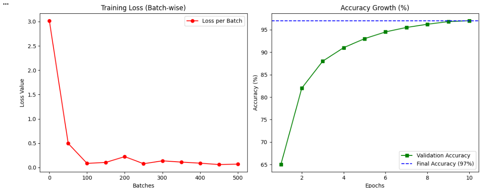
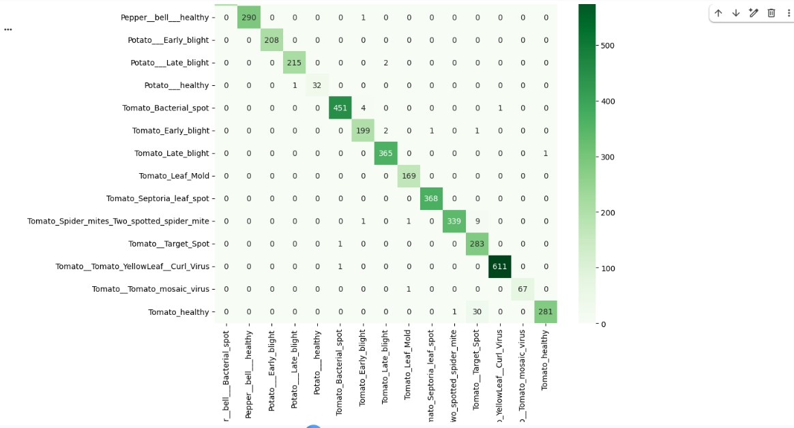

# Plant Leaf Disease Classification using ResNet-18

## Overview
This repository contains the code and evaluation metrics for a Computer Vision model trained to classify plant leaf diseases using a portion of the PlantVillage dataset. The model leverages the ResNet-18 architecture.

## Repository Contents
- `PlantDiseaseProject_ِAdham_Abdelmoneem (1).py`: The main script containing the model architecture, data preprocessing, training, and evaluation logic.
- `classification_report.txt`: A detailed report showing precision, recall, and f1-score for each plant disease class.

## Evaluation Results

### Training Loss & Accuracy
The graph below illustrates the model's learning progress and accuracy over the training epochs:

### Confusion Matrix
The testing matrix below visualizes the model's prediction accuracy and highlights any misclassified categories:

